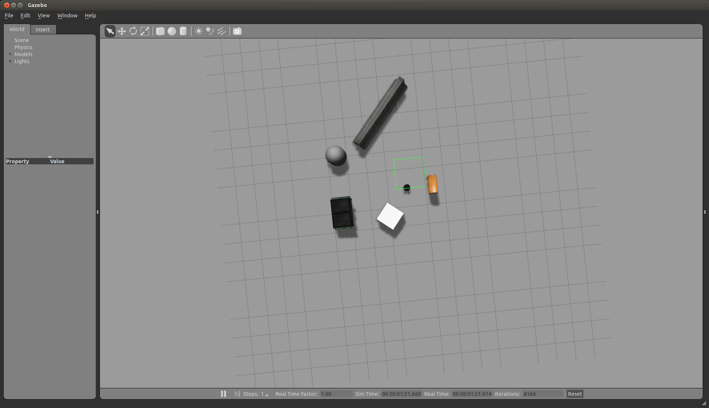

# ros-gazebo-example
A navigation example using turtle bot to sweeping through an environmnet

# Instaling turtlebot

We will be using the turtle bot as our working example robot. First you will have to install the ros packages 
for the turtle bot. These packages depend on gazebo2 which is the default provided when you install indigo-full-desktop.
If you want to use a more recent version of gazebo you will have to build the turtlebot packages from source.

	
```bash
sudo apt-get install ros-indigo-turtlebot
sudo apt-get install ros-indigo-turtlebot-*
```

Then run the following command:

```bash
roslaunch turtlebot_gazebo turtlebot_world.launch
```

If all goes well you should see the following:
<center>
 
</center>

If Gazebo loads up and the screen is black (it was the case for me) follow the fix instructions on this 
page: [gazebo2-with-black-screen](http://answers.gazebosim.org/question/12773/gazebo2-with-black-screen/).


## resources

### turtle bot

* [turtle bot navigation tutorial](http://wiki.ros.osuosl.org/turtlebot_navigation/Tutorials/indigo/Setup%20the%20Navigation%20Stack%20for%20TurtleBot)

* [turtle bot rviz](http://wiki.ros.org/turtlebot_simulator/Tutorials/hydro/Explore%20the%20Gazebo%20world)

* [turtlebot_simulator](https://github.com/turtlebot/turtlebot_simulator)

* [learn turtle bot](http://learn.turtlebot.com/2015/02/03/3/)

### Drones in Gazebo

[gazebo drones](http://gazebosim.org/blog?page=2)

